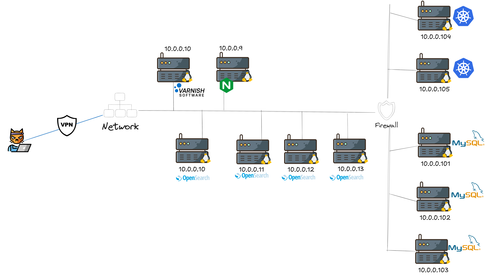

# 🧪 Prueba Técnica – Ravenloop

Este repositorio forma parte de una prueba técnica para **Ravenloop**.  
No existen respuestas cerradas ni soluciones únicas: buscamos reflejar **cómo piensas, cómo estructuras la información y cómo identificas necesidades y mejoras en sistemas reales**.

---

## 🔍 ¿Qué buscamos?

El objetivo de esta prueba es que analices y expliques los diferentes archivos de configuración incluidos en este repositorio. La idea es que sea en una charla en vivo con nosotros puedes modificar, comentar o ampliar cualquier parte del contenido en tu local si lo consideras necesario.

### 1. ✏️ Explicación de cada fichero de configuración

Para cada uno de los siguientes elementos, se espera una explicación clara:

- **Qué función cumple el fichero**
- **Qué estructura tiene y por qué está organizada así**
- **Comentarios o sugerencias sobre errores, ambigüedades o mejoras posibles**
- **Valoraciones sobre la claridad, mantenibilidad y buenas prácticas**

---

### 2. ⚙️ Explicación del funcionamiento global

Queremos entender cómo comprendes **el conjunto del sistema**, es decir:

- Cómo interactúan entre sí los componentes (servicios, volúmenes, redes, pipelines, etc.)
- Cuál es el **flujo de trabajo** entre los distintos elementos
- Qué implicaciones tiene la arquitectura actual en cuanto a despliegue, mantenimiento o escalado

---

### 3. 🏗️ Análisis de arquitectura

Queremos leer tu visión crítica sobre la arquitectura actual:

- ¿Hay puntos de fallo únicos (SPOF)?
- ¿Es fácilmente escalable?
- ¿Qué pasa si un servicio falla?
- ¿Es una arquitectura robusta, simple, sobredimensionada…?
- ¿Se adapta bien a un entorno CI/CD moderno?

---

### 4. 🧰 Recomendaciones y mejoras

Además del análisis, queremos tus **recomendaciones técnicas**:

- ¿Qué servicios podrían complementar la arquitectura (monitorización, logging, cache, tracing…)?
- ¿Qué configuraciones de seguridad faltan?
- ¿Cambiarías el modo de exponer servicios en kubernetes (razona la respuesta)?
- ¿Hay mejores prácticas que se podrían aplicar para producción?

---

### 5. 🚀 Explicación del pipeline de CI

Explícanos cómo añadirías un pipeline de CI que cubra:

- Pruebas de calidad del código (linting, formato)
- Validación de los archivos de configuración
- Build de imágenes y despliegue (si aplica)
- Pruebas automáticas (unitarias o funcionales si las hubiera)

---

## 🧠 Recomendaciones para la reunión

- Sé claro, pero no temas dejar opiniones técnicas subjetivas, es lo que buscamos.
- Los comentarios con visión crítica o propuestas realistas de mejora se valoran mucho más que “respuestas perfectas”.
- No tengas miedo de buscar en internet ayudas de documentación técnica o ideas de código, tienes poco tiempo usaló para reforzar tus ideas.

---

**¡Gracias por tu tiempo y por compartir tu forma de pensar!**

> Equipo de Ingeniería — Ravenloop